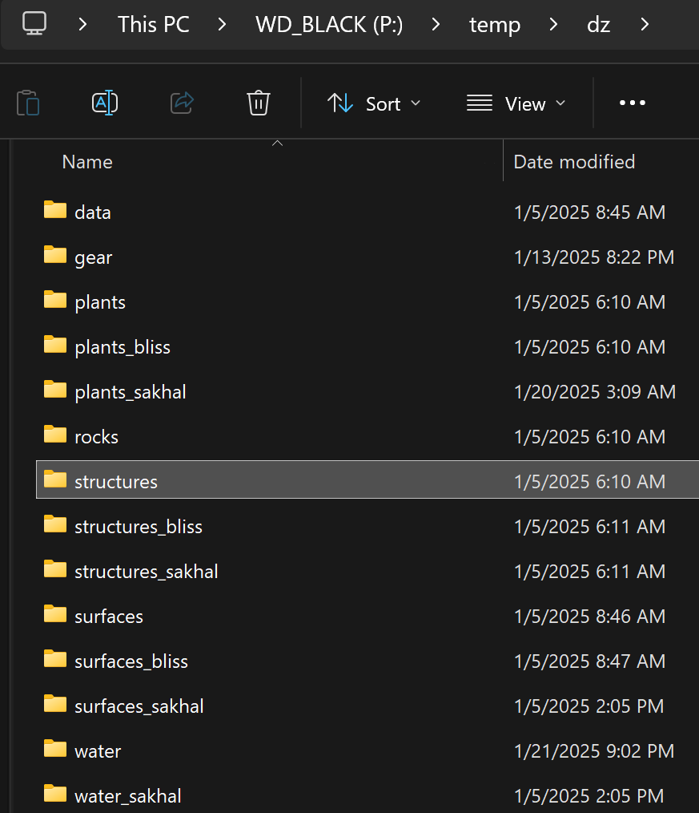

# Binarized Road Parts
Contains the original binarized road parts for **Chernarus, Livonia, and Sakhal**.

> [!TIP]
> Retaining the directory name `parts_og` will allow you to keep them available in case of need; while the debinarized parts used for Road Tool can be maintained as the actual `parts` directory.

---
**Chernarus:** Place these into your `P:/DZ/structures/roads/` directory.

**Livonia:** Place these into your `P:/DZ/structures_bliss/roads/` directory.

**Sakhal:** Place these into your `P:/DZ/structures_sakhal/roads/` directory.

## ↳📁 `P:/Temp/dz` Example:

> [!IMPORTANT]
> When packing your project your `P:/temp` needs to contain a copy of these binarize road parts within their respective folders within `temp`. (i.e. `P:/temp/dz/structures/roads/parts` must contain the used Chernarus parts you have in your project); so on so forth with Enoch & Sakhal having their own respective directories within the `temp` folder as well.

